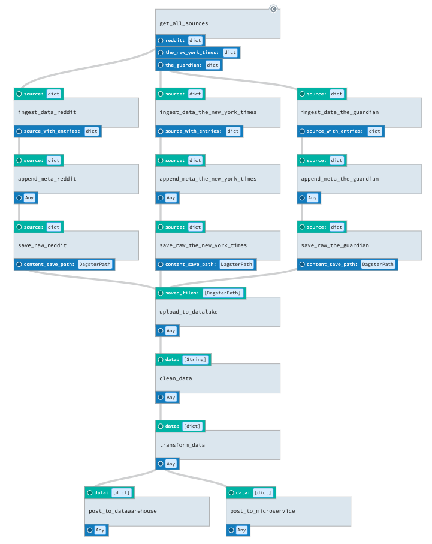

# Overview

This demo illustrates a data pipeline leveraging Dagster to ingest news articles metadata from list of sources, by parsing RSS feeds, saving the result in json format and uploading the results to a datalake (e.g. S3 bucket). Subsequently the raw data is cleansed, transformed and posted to data warehouse as well as to other microservice.

The logic for each solids are not fully implemented (from `upload_to_datalake` onwards) but the overall pipeline works end-to-end on manual trigger. It is trivial to set this to run on a schedule basis with the built-in scheduler provided.

# Instructions:

1. Create virtual environment and activate with `python -m venv venv && `source venv/bin/activate`

2. Install packages with `pip install -r requirements.txt`

3. Run the script with `source run.sh`

4. Go to http://127.0.0.1:3000
